# ARCHITECTURE

本ドキュメントは、実装済みコンポーネントを基準にシステム全体像とデータフローを整理した設計地図です。
詳細な運用手順は README、DEPLOYMENT、terraform/README、CONTRIBUTING を参照します。

## 1. システム全体俯瞰図

この俯瞰図は本番運用の経路を主軸に記述し、ローカル開発経路は補助線として表現します。
ローカルから本番環境への直接アクセスは遮断される前提のため、図中でも「X」注記で明示します。
現状では Terraform apply、loader 実行、dbt 実行の後段は CI/CD 化されていますが、本番入力データの供給経路はまだ完全自動化されていません。

### 1.1 コンポーネントの役割

- Docker Compose
  - ローカル開発の実行基盤
  - streamlit, api, dagster を同一リポジトリで起動
- GitHub Actions
  - lint, test, dbt debug, terraform plan/apply, loader, dbt run/test を制御
  - 本番データ取り込みと本番 dbt 実行の標準経路
  - ただし本番入力 CSV の生成・配置までは現時点で担っていない
- HCP Terraform
  - Snowflake リソースの宣言的管理
  - dev/prod ワークスペースを分離
- Snowflake
  - Bronze, Silver, Gold の Medallion レイヤーを保持
  - Loader と dbt が主な書き込み経路

## 2. Snowflake 内部レイヤー構造

### 2.1 各レイヤー定義

- Bronze RAW_DATA
  - 取り込み直後データ
  - 主に CSV のロード結果を保持
- Silver CLEANSED
  - 型変換、整形、ドメイン中間ロジック
  - 例: staging モデル、配送コスト候補モデル
- Gold MARKETING_MART
  - BI/アプリ参照用モデル
  - Streamlit が直接参照する最終分析テーブル

### 2.2 変換ルール

- Bronze から Silver
  - 型変換とクレンジングを優先
  - 欠損や不正値の扱いを一貫化
- Silver から Gold
  - ユースケース単位で意味を確定
  - KPI 計算や参照負荷を最適化

## 3. データフローと処理方式

## 3.1 入力から出力までの一貫フロー

### 3.2 現行のインジェスト方式

- 現行実装は Snowflake Internal Stage への PUT と COPY INTO を採用
- トリガーはバッチ実行
  - ローカル: 手動実行
  - 本番: CI のジョブチェーンで実行
- ただし本番で loader が読む CSV の供給元は未確定
  - CI が CSV を自動生成する実装にはなっていない
  - 現状の俯瞰図では「外部または事前配置された入力」として扱う
- Snowpipe や外部 S3 連携は現行の標準経路ではない
  - 将来拡張時は本ドキュメントへ追記し、運用手順を更新する

### 3.3 バッチ頻度と Freshness

- ローカル
  - 開発者の手動実行タイミングに依存
- 本番
  - main への push 後、承認ゲート通過後に順次実行
  - terraform apply -> loader -> dbt run -> dbt test
- 評価
  - インフラ適用と変換処理の自動化は実用水準に近い
  - 一方で入力データ供給が未標準化のため、完全自動の本番データパイプラインとはまだ言えない
- Freshness の目安
  - 完全リアルタイムではなく、ジョブ完了時点のスナップショット整合を重視

## 4. CI/CD が影響するリソース境界

### 4.1 実行ポリシー

- prod 実行は main push に限定
- prod apply 前に単一承認ゲートを配置
- 承認後は後続を自動継続

## 5. セキュリティとネットワーク境界

## 5.1 認証と鍵管理

- パスワード認証は採用しない
- RSA キーペア認証を標準化
- 秘密鍵の管理
  - ローカル: .env
  - CI: GitHub Secrets
  - Terraform 実行: HCP Terraform Workspace Variables

## 5.2 アクセス境界

- ローカル実行
  - APP_ENV 未指定時は dev
  - prod 実行はアプリ側ガードで抑止（ローカルから本番への直接アクセスは禁止）
- CI 実行
  - prod 実行は main push + environment 承認に限定
- Snowflake 側
  - ロール分離
  - dev/prod のユーザーと権限を分離

## 5.3 暗号化の観点

- 通信は Snowflake 接続の標準 TLS に依存
- 認証は公開鍵暗号に基づく JWT フロー

## 6. オブザーバビリティ設計の土台

## 6.1 どこで滞留しやすいか

- Loader 失敗時
  - Internal Stage まで投入済みで Bronze 反映が止まる
- dbt run 失敗時
  - Silver まで更新済みで Gold 反映が未完了になる可能性
- dbt test 失敗時
  - データは作成済みでも品質ゲート未通過になる

## 6.2 主要な観測ポイント

- GitHub Actions 実行ログ
- artifact
  - terraform plan/apply ログ
  - loader ログ
  - dbt run/test ログ
  - run_results.json

## 7. 用語集

- APP_ENV
  - 実行環境スイッチ。権限そのものではない
- Bronze, Silver, Gold
  - Snowflake 内のデータレイヤー区分
- Loader
  - CSV を Snowflake へ取り込む Python スクリプト
- dbt project
  - src/transform 配下の変換定義

## 8. 本ドキュメントの整合方針

- 用語と運用ルールは CONTRIBUTING と一致させる
- Terraform 運用の詳細は terraform/README を正本とする
- デプロイ実行順序の詳細は DEPLOYMENT を正本とする
- 権限モデルと保護方針は GOVERNANCE を正本として同期する

## 9. 図の管理方針

- Mermaid のソースは `docs/diagrams/*.mmd` に分離して管理する
- `ARCHITECTURE.md` では生成済みの SVG を参照する
- GitHub ダークモードでの視認性を保つため、SVG は白背景で生成する
- 図を更新した場合は対応する SVG も再生成する
